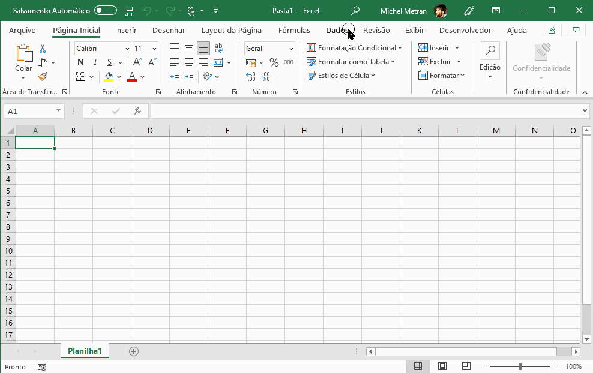

# Correção Monetária de Débitos Judiciais

 

O [Tribunal de Justiça do Estado de São Paulo](https://www.tjsp.jus.br/) disponibiliza mensalmente as taxas para
calcular a correção monetária de multas e débitos judiciais. As taxas atualizadas são divulgadas por meio de um arquivo
em formato *.pdf*,
intitulado [TabelaDebitosJudiciais.pdf](https://www.tjsp.jus.br/Download/Tabelas/TabelaDebitosJudiciais.pdf).

O repositório [gaemapiracicaba/correcao_monetaria](https://github.com/gaemapiracicaba/sp_tjsp_correcao_monetaria)
objetivou criar uma função para converter esse arquivo _.pdf_ em formato tabular (_.csv_) e disponibilizar isso de
maneira facilitada, por meio de um servidor, com atualização periódica!

 

## Como Usar?

O arquivo _.csv_ disponível no servidor é atualizado todas as terças-feiras e quintas, as 4h00 e fica disponível no
endereço a seguir:

- <a href="https://gaemapiracicaba.github.io/assets/correcao_monetaria/data/tabela_debitos_judiciais.csv" target="_blank">https://gaemapiracicaba.github.io/assets/correcao_monetaria/data/tabela_debitos_judiciais.csv</a>

 

### *Google Spreadsheets*

Uma vez que o arquivo _.csv_ está disponível em um servidor, é possível utilizar a função **_=IMPORTDATA()_** do _Google
Spreadsheets_ para acessa-lo diretamente na tabela, possibilitando cálculos etc.

 

Visando auxiliar essa etapa, **já foi criada uma tabela com a função**, bastando criar uma cópia da tabela para sua
conta _Google_.

<a href="https://docs.google.com/spreadsheets/d/1xOH1QN8qsZ3-_u6p1dbhIZ2N4IvSBbMJucM1BhXf8Sw/edit?usp=sharing" class="btn btn--primary">*Google Spreadsheets*</a>

 

### *Microsoft Excel*

No *Microsoft Excel* é possível também manter o arquivo atualizado em uma aba, por meio dos passos abaixo:

 

### Outros Formatos

É possível também acessar a tabela em formatos *.csv* e *.pdf* nos botões abaixo:

<a href="https://gaemapiracicaba.github.io/assets/correcao_monetaria/data/tabela_debitos_judiciais.csv" class="btn btn--primary">
Download *csv*</a>  
<a href="https://gaemapiracicaba.github.io/assets/correcao_monetaria/data/tabela_debitos_judiciais.pdf" class="btn btn--primary" target="_blank">
Download *pdf*</a>
